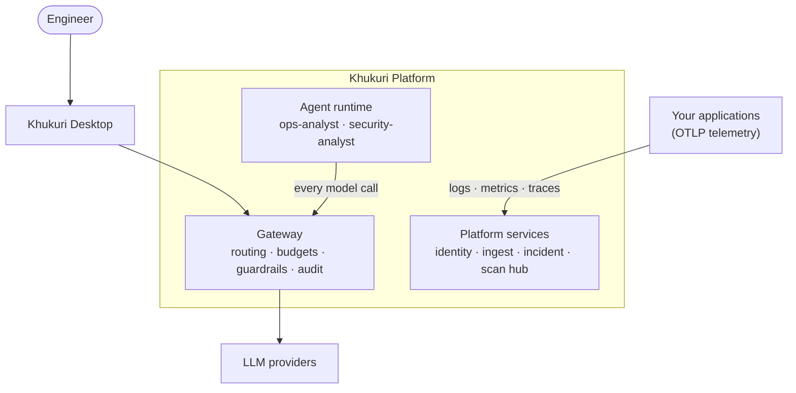

# Khukuri 🗡️

**An AI operating system for running software.**

Khukuri connects an AI reasoning layer to your real operational data — logs, metrics, traces, deployments, code, vulnerabilities — so an engineer can ask *"why is production failing?"* or *"what is our exposure to this CVE?"* and get a grounded, auditable answer with a recommended, approval-gated fix.

> Named after the Gurkha blade: a precision instrument, trusted under pressure.

## Why

Observability tools show you *what* is happening. Scanners show you *that* something is vulnerable. Neither answers the questions engineers actually ask: *why is this happening, does it matter for us, and what should I do right now?* Khukuri puts a reasoning layer — grounded in your own telemetry and code, gated by your approval, logged in your audit trail — behind those questions.

## How it works



Three rules define the architecture:

1. **The Gateway is the only door to models.** Every model call — chat, agent reasoning, scan triage — passes through auth, routing, budgets, guardrails, and audit.
2. **Agents act through tools; tools act through APIs.** The agent runtime never touches infrastructure directly.
3. **Mutations require human approval.** Anything state-changing is a `PENDING_APPROVAL` record a human resolves — with the approver's identity in the audit log.

Full design: [docs/ARCHITECTURE.md](docs/ARCHITECTURE.md) · End-to-end scenarios: [docs/WORKFLOWS.md](docs/WORKFLOWS.md) · Decisions: [docs/adr/](docs/adr/)

## Proven against real applications

Khukuri is developed against three **live tenants**, not fixtures: a retail point-of-sale system in real use, a quick-service restaurant POS, and Khukuri itself (the platform monitors its own services).

## Status

| Module | Purpose | Status |
|---|---|---|
| [gateway](gateway/) | LLM gateway: security pipeline, budgets, multi-tenancy, audit | ✅ migrated, deployed lineage — [details](gateway/README.md) |
| [services/identity](services/identity/) | OIDC, tenants, RBAC, per-tenant keys | ✅ v0 — [details](services/identity/README.md) |
| [services/ingest](services/ingest/) | OTLP → Kafka → ClickHouse | 🧱 Phase 2 |
| [services/incident](services/incident/) | Detection, incident lifecycle, telemetry query API | 🧱 Phase 2 |
| [services/scanhub](services/scanhub/) | Security scan orchestration, findings | 🧱 Phase 2 |
| [ai/agent-runtime](ai/agent-runtime/) | Agent loop, tools, approval gates | 🧱 Phase 2 |
| Khukuri Desktop | Tauri + React client | separate repo, migrating |

## Quick start (data plane)

Application services are under construction; the data plane runs today:

```bash
cd infra/compose
cp .env.example .env
docker compose up -d
```

Brings up Postgres, ClickHouse, Kafka (KRaft), Redis, and an OpenTelemetry Collector. See [infra/compose/README.md](infra/compose/README.md) for ports and profiles.

## Stack

Java 21 / Spring Boot (gateway + platform services) · Python / FastAPI (agent runtime) · Tauri + React (desktop) · Postgres · ClickHouse · Kafka · Redis · OpenTelemetry · Docker Compose · Terraform on AWS.

## License

[Apache-2.0](LICENSE)
