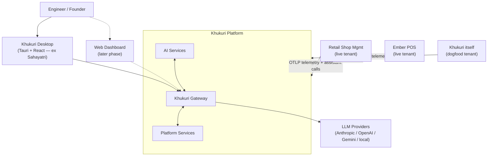
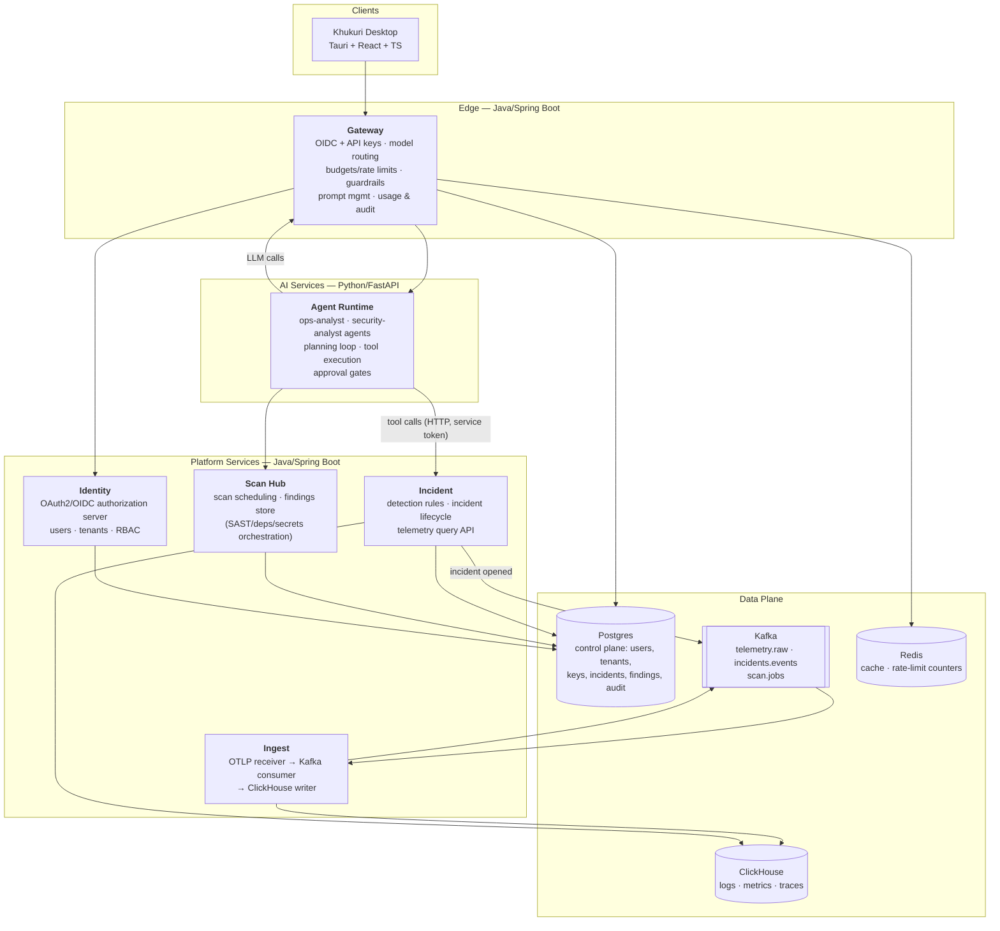

# Khukuri — Platform Architecture

**Version:** 0.1 (draft) · **Date:** 2026-07-27 · **Status:** Approved direction, pre-implementation

> Khukuri is an AI operating system for running software: an AI-native platform that monitors, secures, explains, and operates production systems. Named after the Gurkha blade — a precision instrument, trusted under pressure.

---

## 1. Product in one paragraph

Companies run software they cannot fully see into. Khukuri connects an AI reasoning layer to a company's real operational data — logs, metrics, traces, deployments, code, vulnerabilities — so an engineer can ask *"why is production failing?"* or *"what is our exposure to this CVE?"* and get a grounded, auditable answer with a recommended (and optionally automated, always approval-gated) fix. It is Datadog's data plane, a SOC's judgment, and a staff engineer's reasoning behind one chat window.

## 2. Scope of this document

Covers the target architecture for the **3–4 month build** (Phases 1–2: Foundation + Security/Ops vertical) and the module boundaries that later phases (Workforce, Knowledge, Cloud Control, Vision) slot into. It deliberately does **not** design those later phases beyond their interfaces.

## 3. Design principles

1. **Gateway is the only door to models.** No service or client calls an LLM provider directly. All model traffic — desktop chat, agent reasoning, scan summarization — flows through Khukuri Gateway for auth, routing, budgets, guardrails, and audit. (Existing violation to fix during migration: Sahayatri's image generation calls providers directly.)
2. **Real tenants or it didn't happen.** The platform is demonstrated against live applications (Retail Shop Management, Ember POS) and against **itself** (`khukuri` is its own third tenant — dogfooding). No toy fixtures in demos.
3. **Agents act through tools; tools act through APIs; mutations require approval.** The agent runtime never touches infrastructure directly — it calls typed platform APIs, and anything state-changing goes through an explicit human-approval gate with an audit record.
4. **Boring core, sharp edge.** Control plane is conventional Spring Boot + Postgres — the innovation budget is spent on the AI/ops vertical, not on exotic infrastructure.
5. **Local-first, cloud-proven.** The entire platform boots with one `docker compose up`. A thin, Terraform-managed AWS slice proves real deployment (~$20–50/mo). Nothing in the architecture assumes big cloud spend.
6. **Every cross-service contract is written down** in `contracts/` (OpenAPI + event schemas) before implementation. Services may be rewritten; contracts are stable.

## 4. System context (C4 level 1)



## 5. Container view (C4 level 2)



### Container responsibilities

| Container | Stack | Owns | Never does |
|---|---|---|---|
| **Gateway** | Spring Boot (migrated from existing deployed LLM gateway) | AuthN of every request, model abstraction/routing, per-key budgets & rate limits, guardrails (prompt-injection & secret-leak filters), prompt templates, usage metering, request audit | Business logic; talking to ClickHouse |
| **Identity** | Spring Authorization Server | OIDC login, tenants, users, roles, service accounts, per-tenant ingest/API keys | Anything AI |
| **Ingest** | Spring Boot + OTel | OTLP gRPC/HTTP receiver → `telemetry.raw` (Kafka) → batch insert into ClickHouse | Interpretation of data |
| **Incident** | Spring Boot | Threshold/anomaly detection rules over ClickHouse, incident lifecycle (open→ack→resolved), **Telemetry Query API** (the tool surface agents use) | Calling LLMs directly |
| **Scan Hub** | Spring Boot | Scheduling dependency/secret/container scans (wrapping Trivy/Gitleaks etc.), normalized findings store | Interpreting findings (agents do) |
| **Agent Runtime** | Python + FastAPI | Agent definitions, planning loop, tool registry & execution, approval-gate protocol, run transcripts | Holding provider API keys; direct infra mutation |
| **Desktop** | Tauri + React | Chat, incident & findings views, approval prompts, dashboards | Direct provider calls (must be removed in migration) |

## 6. Tenancy & security model

- **Tenants:** `retail-shop`, `ember`, `khukuri` (self). Every control-plane row and every telemetry record carries `tenant_id`. Row-level scoping in Phase 1–2; schema-per-tenant is a documented later hardening step, not built now.
- **Humans:** OIDC (Identity service) → JWT with tenant + roles. Roles: `owner`, `admin`, `analyst`, `viewer`.
- **Satellite apps:** per-tenant **ingest keys** (telemetry) and **gateway keys** (assistant features — Retail Shop already works this way today; this pattern is generalized).
- **Services:** OAuth2 client-credentials service tokens; no shared secrets in code; secrets via env locally, SSM in AWS.
- **Agents:** the approval gate is a first-class protocol — a `PENDING_APPROVAL` tool-call state persisted in Postgres, surfaced in Desktop, resumed on human approve/deny. Read-only tools (query logs, read metrics, fetch repo file) auto-execute; mutating tools (restart service, open PR, change config) always gate.
- **Audit:** gateway logs every model call (who, tenant, model, tokens, cost, guardrail verdicts); agent runtime logs every tool call and approval decision. Both land in Postgres audit tables — this is a headline enterprise feature, not an afterthought.

## 7. Data-plane choices (with reasoning)

| Choice | Why | Rejected alternatives |
|---|---|---|
| **ClickHouse** for logs/metrics/traces | Columnar analytics fits "agent asks aggregate questions about telemetry"; native OTel exporter; runs fine single-node in Compose; recognized enterprise choice | Loki+Prometheus (two systems, weak ad-hoc SQL for agents); Elasticsearch (heavy, pricey); Postgres-only (falls over on telemetry volume, weak portfolio signal) |
| **Kafka** as the telemetry/event bus | Decouples ingest from storage; replayable; event-driven backbone for incidents/scans; founder's existing strength — high signal | Direct writes (no buffering/replay, no EDA story); Redpanda (fine, but Kafka name recognition wins for portfolio) |
| **Postgres** control plane | Boring, correct, already used by the gateway | — |
| **Redis** | Rate-limit counters + hot cache (gateway already uses this pattern) | — |

## 8. Repository & org layout

GitHub org **`khukuri-ai`** (public, Apache-2.0):

```
khukuri/                     # ← core monorepo (this repo)
  gateway/                   # Spring Boot — migrated from llm-api-gateway
  services/
    identity/
    ingest/
    incident/
    scanhub/
  ai/
    agent-runtime/           # Python/FastAPI
  contracts/
    openapi/                 # one spec per service
    events/                  # Kafka topic schemas (JSON Schema/Avro)
  infra/
    compose/                 # docker-compose.yml + profiles (full / minimal)
    terraform/               # AWS thin slice (EC2 t4g.small + Caddy + SSM)
    kind/                    # local k8s manifests (Phase 2+)
  docs/
    ARCHITECTURE.md          # this file
    WORKFLOWS.md
    adr/                     # ADR-001..NNN
  .github/workflows/         # CI: build, test, scan, publish images

khukuri-desktop/             # ← separate repo (ex sahayatri-ai)
retail-shop/                 # ← satellite tenant repo (existing)
ember/                       # ← satellite tenant repo (existing)
```

**Migration order:** gateway first (it's deployed and battle-tested), then identity extraction, then new services. The old `llm-gateway-phase*`, `sentinelai-*` folders and zips get archived, not migrated.

### ADRs to write in week 1

ADR-001 monorepo + umbrella org · ADR-002 rebrand (SentinelOne collision) · ADR-003 ClickHouse for telemetry · ADR-004 Kafka event bus · ADR-005 Java core / Python AI split · ADR-006 Spring Authorization Server over Keycloak (self-built = stronger portfolio signal, acceptable scope for single-realm needs) · ADR-007 approval-gate protocol.

## 9. Deployment topology

**Local (daily dev + full demo):** single `docker compose up` → all services + Postgres + ClickHouse + Kafka + Redis + OTel Collector. Profiles: `full`, `minimal` (gateway+identity+desktop only).

**AWS thin slice (Terraform, ~$20–50/mo):** one `t4g.small` EC2 running Compose (gateway, identity, Postgres) behind Caddy with TLS; state in S3; secrets in SSM. Purpose: honest "deployed on AWS with IaC" claim + live demo endpoint. Explicitly *not* EKS — that's a documented cost decision (`infra/terraform/README`), which is itself good engineering signal.

**Telemetry stays local** for demos in this phase; the heavy data plane does not run in the paid slice.

## 10. Module map to later phases

| Future module | Slots into | Interface that already exists for it |
|---|---|---|
| Khukuri Workforce (DevSecOps agents) | Agent Runtime | same agent framework, new agent definitions + tools |
| Khukuri Knowledge (RAG/graph) | new `ai/knowledge` service | Agent Runtime tool: `search_knowledge` |
| Khukuri Cloud Control | new service behind approval gates | mutating-tool protocol |
| Khukuri Vision | out of scope v1 | new ingest type on Kafka |

## 11. Phase 1–2 exit criteria

**Phase 1 (Foundation, ~Aug):** one login (OIDC), one gateway (migrated, rebranded), Khukuri Desktop chatting through it end-to-end, full platform up via Compose, Terraform slice applied, org + monorepo public with CI, README + this doc + demo GIF live.

**Phase 2 (Vertical, ~Sep–Oct):** both satellite tenants shipping OTLP telemetry; incident service detecting a real induced failure; *"why is the shop failing?"* answered by the ops-analyst agent from real logs with a correct root cause; one approval-gated remediation executed; scan hub producing findings the security-analyst agent can explain; all of it visible in Desktop; demo video recorded.
